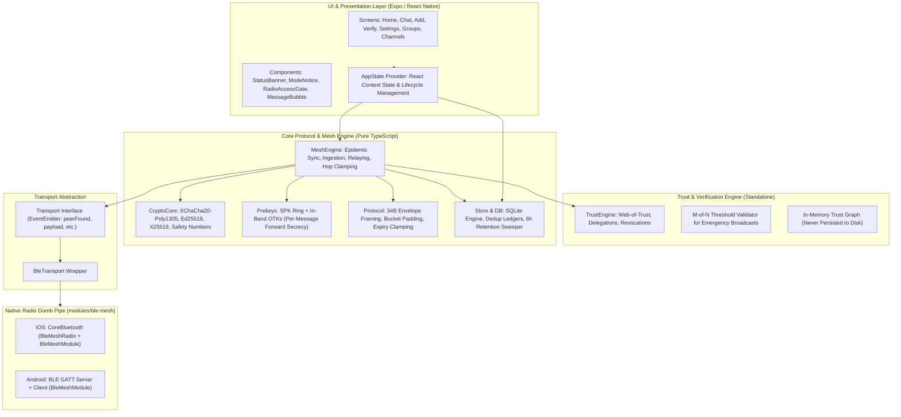
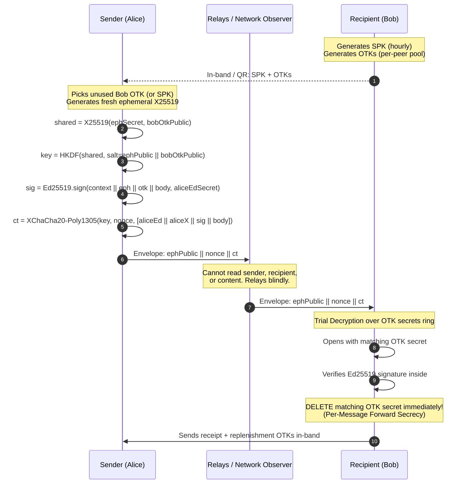

# ChitChatChit Complete System Architecture & Rebuild Blueprint

## 1. System Overview & Core Philosophy

**ChitChatChit** is a decentralized, off-grid, epidemic store-and-forward messaging application designed specifically to survive **internet blackouts and local RF jamming** (such as police 3G/4G/5G cellular jammers, which do not target 2.4 GHz ISM bands).

### Core Architectural Axioms

1. **No Infrastructure, Zero Accounts:** No phone numbers, centralized servers, accounts, or cloud backups. Identity is an Ed25519/X25519 seed stored in hardware-backed storage (`WHEN_UNLOCKED_THIS_DEVICE_ONLY`).
2. **Dumb Byte-Pipe Radio Layer:** The native radio code (Swift CoreBluetooth / Kotlin BLE GATT) contains **zero** chat logic, zero storage, and zero crypto. It acts purely as a transport pipe (advertising, scanning, chunking, reassembly).
3. **Epidemic Routing (Not Addressed):** There are no routing tables. A routing table is a graph of who speaks to whom. Instead, every phone carries all unexpired envelopes it has observed and offers them to every peer it meets. Recipients identify their messages via **trial decryption**.
4. **Signature Inside the Ciphertext:** The sender's signature lives *inside* the encrypted payload. Relays forward envelopes without knowing the sender, recipient, or message content.
5. **Anti-Forensics & Short Retention:** A seized unlocked phone is the primary threat model adversary. Decrypted messages and envelopes expire and are swept after 6 hours based on local *first-sight* timestamps. Atomic panic wipe destroys the identity seed and wipes all databases.

---

## 2. High-Level Architecture



---

## 3. Layer-by-Layer Architectural Breakdown

### Layer 1: Native Radio Layer (`modules/ble-mesh/`)

A standalone Expo native module implementing a raw BLE GATT mesh interface.

- **Dual-Role Concurrency:** Every phone operates simultaneously as a **Peripheral** (GATT Server advertising) and a **Central** (GATT Client scanning and dialing peers).
- **GATT Service Layout:**
  - Service UUID: `7B3C1A80-9F42-4E17-9A6D-2C5E8B1F0D31`
  - Inbound Characteristic (peer $\to$ us): `...1A81` (`WRITE`, `WRITE_NO_RESPONSE`)
  - Outbound Characteristic (us $\to$ peer): `...1A82` (`NOTIFY` with CCCD on Android)
- **MTU & Chunking Strategy:**
  - BLE frames are limited (20 to 512 bytes), whereas envelopes can reach 30,000 bytes.
  - Chunking and reassembly are handled **natively** (in Swift/Kotlin) rather than in JS to eliminate bridge overhead and accurately track link-specific MTU flow control.
  - Native 8-byte frame header:
    `[0: Version (1B)] [1: Type (DATA=0, HELLO=1) (1B)] [2-3: MessageId (2B)] [4-5: ChunkIndex (2B)] [6-7: ChunkCount (2B)] [8...: Chunk Payload]`
  - Reassembly limits: Max 4 concurrent incoming assemblies per peer, 32,768 byte ceiling, 30s timeout sweep.
- **Privacy & Advertised Tag Rotation:**
  - To prevent device tracking via radio beacons, advertisements contain **only** the Service UUID and a random 4-byte CSPRNG tag.
  - Advertisements **never** leak the user's name, public key, or any deterministic hash.
  - The tag rotates every 15 minutes (`DEFAULT_ROTATION_MS`).
- **Duplicate Link Resolution:**
  - When Phone A and Phone B discover each other simultaneously, both dial out and both connect.
  - In-band `HELLO` packets exchange full 8-byte tags.
  - Tie-break rule: The device with the lexicographically smaller tag preserves its outbound link and drops the inbound link; the other side does the exact reciprocal.

---

### Layer 2: Transport Abstraction (`src/lib/transport.ts`)

Decouples the mesh engine from the physical radio medium:
- Defines `Transport` interface: `start()`, `stop()`, `send(peerId, b64)`, `available`.
- Events: `peerFound`, `peerLost`, `connected`, `disconnected`, `payload`, `error`.
- Enables unit and integration testing without hardware by injecting an in-memory transport mock (`FakeTransport`).
- Supports future hardware adapters (e.g., LoRa SX1262, Wi-Fi Aware/Neighbor Awareness Networking, or internet border gateways).

---

### Layer 3: Wire Protocol & Padding (`src/lib/protocol.ts`)

Envelopes are strictly serialized into binary structures:

```
+---------------+---------------+---------------+--------------------+
|  Magic (2B)   |  Version (1B) |   Type (1B)   |  Envelope ID (16B) |
|   0x50 0x43   |     0x01      | 1/2/3 (Sealed)|    Random CSPRNG   |
+---------------+---------------+---------------+--------------------+
|   Timestamp (6B, 48-bit be)   |  TTL Seconds (4B, 32-bit be)       |
|    Rounded to 60s bucket      |         Default: 21,600s (6h)      |
+---------------+---------------+---------------+--------------------+
| HopCount (1B) |  MaxHops (1B) | Payload Length (2B, 16-bit be)     |
|   Incremented |  Clamped to 6 |            Up to 30,000            |
+---------------+---------------+---------------+--------------------+
|                     Payload Data (N Bytes)                         |
+--------------------------------------------------------------------+
```

#### Envelope Types
1. `Sealed (1)`: Encrypted application payload.
2. `Inventory (2)`: List of 16-byte envelope IDs currently held by this peer.
3. `Request (3)`: List of 16-byte envelope IDs requested from the peer.

#### Metadata Defenses
- **Payload Length Padding:** All plaintext payloads are padded to defined bucket sizes before encryption: `256, 512, 1024, 2048, 4096, 8192, 16384` bytes. Observers cannot infer message length.
- **Timestamp Coarsening:** Timestamps are floored to 60,000 ms (1 minute) boundaries to prevent microsecond clock skew device fingerprinting.
- **Hop Clamping:** Relays clamp incoming `maxHops` to `MAX_HOPS = 6` to prevent malicious envelopes from cycling indefinitely.

---

### Layer 4: Cryptography & Forward Secrecy

Implementation: `src/lib/crypto-core.ts`, `src/lib/prekeys.ts`



#### 1. Identity & Keys
- Seed: 32 CSPRNG bytes in OS keystore.
- Long-term Signing: Ed25519 keypair derived directly from seed.
- Long-term Agreement: X25519 keypair derived via HKDF-SHA256(`info = "chitchatchit/v1/x25519"`).
- Public ID: `Base64(edPublic || xPublic)` (64 bytes).

#### 2. Forward Secrecy without Key Servers (X3DH-adapted)
- **Signed Prekey (SPK):** Medium-term X25519 key, rotated ~hourly, signed by Ed25519 identity, retained for 6 hours.
- **One-Time Prekeys (OTK):** X25519 keys allocated from a pool (floor 8, ceiling 24).
- **Consumption:** When Bob successfully opens an envelope sealed to an OTK, Bob **wipes that OTK secret from memory and SQLite immediately**. If Bob's phone is seized later, past messages cannot be decrypted.
- **Replenishment:** Attached in-band inside encrypted direct messages and delivery receipts (`PrekeyUpdateWire`).
- **QR Introduction Code v2:** `chitchatchit:v2:<publicId>:<spkBundle>`. Contains **only** SPK (no OTKs) because a QR code is scanned by multiple parties, avoiding multi-scan key exhaustion.

#### 3. Channel Cryptography (Symmetric Group)
- Channels possess **no admin, no owner, no kick**.
- Symmetric Key Derivation: `scrypt(passphrase, salt = "chitchatchit/v1/channel" || channelName, N=16384, r=8, p=1)`.
- Channel Binding: Signature inside inner ciphertext signs an HKDF commitment of the channel key, preventing cross-channel message laundering.
- Public Broadcast: Uses a hardcoded, well-known public key. Identical wire framing to private channels so traffic analysis cannot distinguish public announcements from private channel messages.

#### 4. Safety Numbers
- 60-digit fingerprint displayed as twelve 5-digit groups.
- Iterated SHA-256 (5,200 rounds) committing to each public key independently.
- Rejection sampling (`byte < 250`) prevents modulo arithmetic distribution bias.

---

### Layer 5: Mesh Engine & Epidemic Sync (`src/lib/mesh.ts`)

The central coordination state machine:

#### Epidemic Reconciliation Flow
When two phones connect:
1. **Offer Inventory:** Engine collects unexpired envelope IDs, shuffles them (Fisher-Yates) to prevent order fingerprinting, and sends an `Inventory` envelope (capped at 200 IDs).
2. **Compute Delta:** Receiving peer checks `seen` ledger and local `envelopes` table. Missing IDs are requested via a `Request` envelope.
3. **Serve Envelopes:** Serving peer delivers matching envelopes with `hopCount + 1`.
4. **Anti-Amplification:** The engine records which IDs were served to each peer handle (`servedToPeer`). A repeated request from a malicious peer returns nothing, preventing battery-drain amplification attacks. Hard session cap: 600 envelopes.

#### Ingestion & Multi-Tier Deduplication
1. **Ciphertext Deduplication (`seen_messages`):** Hash of raw sealed ciphertext `payload:<sha256>`. Re-wrapping the same payload in a fresh outer envelope to reset hop counts/TTLs is dropped immediately.
2. **Envelope ID Deduplication (`seen`):** 16-byte envelope ID checked.
3. **Trial Decryption:** Tries local prekey secrets, then identity secret, then all joined channel keys.
4. **Content-Hash Deduplication (`seen_messages`):** Hash of decrypted inner body `sha256(sender | conversation | body)`. Prevents message replays if someone re-encrypts an old message.

#### Delivery Receipts & Presence Oracle Defenses
- Delivery receipts are generated **only** for direct and fan-out group messages (never for channels or public broadcast).
- **Gate:** Receipts are emitted **only** if the sender is an explicitly added contact (`isAddedContact = true`). This prevents hostile scanners from pinging devices with random keys to verify a target's physical presence.

---

### Layer 6: Storage Engine & Anti-Forensics (`src/lib/db.ts`, `src/lib/store.ts`)

Local SQLite architecture configured with `PRAGMA journal_mode = WAL;` and `PRAGMA foreign_keys = ON;`.

#### Schema Summary
- `contacts`: `public_id`, `name`, `verified`, `added`, `first_seen`, `last_seen`.
- `messages`: `id`, `peer_id`, `sender_id`, `outgoing`, `text`, `sent_at`, `first_seen`, `state`.
- `message_recipients`: Tracks fan-out delivery receipt status per recipient.
- `envelopes`: The store-and-forward relay cache.
- `channels`: Joined channel passphrases/keys.
- `groups` & `group_members`: Fan-out group rosters (membership is strictly local).
- `seen` & `seen_messages`: Rolling dedup bloom-style ledgers.
- `receive_keys` & `one_time_keys`: Forward secrecy secrets.
- `peer_prekeys`: Public prekey bundles of known peers.

#### Retention & Expiry Policies
- `MAX_LOCAL_RETENTION_MS` = 6 hours (21,600,000 ms).
- Expiry is evaluated strictly against **`first_seen` (local insertion timestamp)**, not the sender's unauthenticated `sent_at` or envelope `createdAt`. This prevents relays from extending message lifetimes artificially.
- Routine background sweeper runs every 60 seconds.
- `wipeEverything()`: Executes atomic transaction deleting all tables, followed by `VACUUM`.

---

### Layer 7: Trust Engine & Web of Trust (`src/trust/`)

A self-contained authorization module for high-stakes broadcast environments:

- **Entity Scopes:** `certify` (can issue delegations), `announce` (can publish trusted broadcasts), `validate` (can counter-sign emergencies).
- **Delegation Chains:** Trust anchors (subscribed Ed25519 keys) certify delegates through signed delegation statements.
- **Memory-Only Graph:** Delegations and trust chains are **never written to disk**. If a phone is seized, the authorization hierarchy cannot be extracted from storage. The graph is reconstructed dynamically in RAM from statements heard over the mesh.
- **Emergency Threshold Verification:** Anyone can emit an `emergency` statement (`pending-emergency`). It transitions to `verified-emergency` only when $M$-of-$N$ subscribed validators counter-sign it.

---

### Layer 8: UI & Application State (`src/lib/app-state.tsx`, `src/app/`)

- Built with **Expo Router v57** (file-based routing) and React Native 0.86.
- **Radio Access Gate:** Enforces Bluetooth power and OS location/bluetooth permissions before mounting radio loops.
- **Conversation Modes (`describeConversation`):**
  - **Public Broadcast (`#public`):** Red warning header ("Public broadcast — anyone nearby can read this, including police").
  - **Channel (`#<name>`):** Amber warning header ("Passphrase channel — anyone with the passphrase can read").
  - **Closed Group (`~<id>`):** Green notice ("Closed group — fan-out encrypted to N members").
  - **Direct Chat:** Green/Amber notice ("Direct message — verified / not verified").

---

## 4. Rebuild Blueprint & Recommended Upgrades

When rebuilding this architecture from scratch, follow this phased implementation path:

### Phase 1: Native Radio Pipe
- Replicate the dual Central/Peripheral GATT architecture.
- Enforce the 8-byte framing and native chunking with MTU auto-negotiation.
- Implement CSPRNG 15-minute advertising tag rotation.
- Implement lexicographical tie-breaking for dual links.

### Phase 2: Cryptographic Core
- Implement XChaCha20-Poly1305, Ed25519, X25519, and HKDF using audited libraries (e.g., `@noble/curves`, `@noble/ciphers`).
- Rebuild SPK and in-band OTK forward secrecy pipeline.
- Implement 60-digit safety numbers.
- **Upgrade Opportunity:** Replace `scrypt` channel key derivation with native `Argon2id` for memory-hard passphrase resistance.

### Phase 3: Mesh State Machine & Sync
- Implement the 34-byte envelope encoding with bucket padding.
- Implement the `Inventory` $\to$ `Request` $\to$ `Sealed` handshake.
- Implement three-tier deduplication (ciphertext hash, envelope ID, plaintext content hash).
- Implement fan-out group jitter (0–3s delay) and receipt gating.

### Phase 4: Local Storage & Sweeper
- SQLite schema with WAL mode.
- 6-hour local first-sight retention enforcement across envelopes and messages.
- Atomic panic wipe procedure (seed destruction $\to$ DB drop $\to$ memory drop $\to$ radio teardown).

### Phase 5: UI & Trust Integration
- Integrate Expo Router or native navigation.
- Implement non-dismissible conversation security warnings.
- Wire in `TrustEngine` for emergency threshold alerts.
